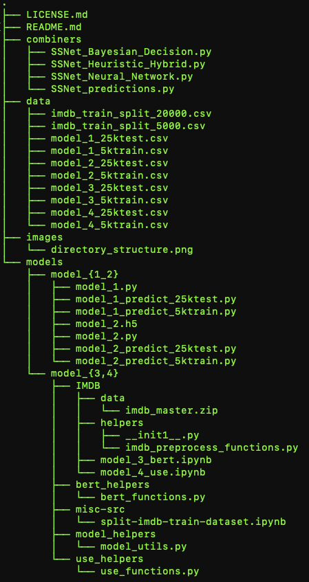

# Research code on deep learning for natural language processing/sentiment analysis
---
## The goal of this project is to explore ideas for improving the accuracy and robustness of neural networks for NLP/sentiment analysis
We draw inspiration from how humans process language. 
When people try to understand nuanced language they typically process
multiple input sensor modalities to complete this cognitive task. It turns out the
human brain has even a specialized neuron formation, called **sagittal stratum**, to
help us understand sarcasm. 

We use this biological formation as the inspiration for
designing a neural network architecture that combines predictions of different
models on the same text to construct robust, accurate and computationally
efficient classifiers for sentiment analysis and study several different realizations.
We have developed a systematic new approach to combining multiple
predictors based on a dedicated neural network. Our approach is backed by a rigorous mathematical
analysis of the combining logic along with state-of-the-art experimental results. We have also developed a
heuristic-hybrid technique for combining models that relies on a heuristic idea of separating the 
set of models into one base and the remaining auxiliary, combined with appropriate Bayesian rules.  Experimental
results on a representative benchmark dataset and comparisons to other methods show the advantages of the new approaches.

Check our research paper ["Can you tell? SSNet - a Sagittal Stratum-inspired Neural Network
  Framework for Sentiment Analysis"](https://arxiv.org/abs/2006.12958) for context and details.

| Proposed Combiner  | Max Accuracy (%) |
| ------------- | ------------- |
| Neural Network Combiner  | 94.11  |
| Bayesian Decision Rule Combiner  | 93.77  |
| Heuristic-Hybrid Combiner  | 94.0  |

## Prototype code, see the [licensing agreement](https://github.com/usnistgov/STVM_NLP_Research/blob/master/LICENSE.md) for terms of use.

## Installation Process:
The project is written using the [TensorFlow](https://www.tensorflow.org/install) library and is compatible with TensorFlow 2.x. The dataset used for the experiments can be found at [SLMRD](https://ai.stanford.edu/~amaas/data/sentiment/) which consists of 25K train reviews and 25K test reviews.

The data is downloadable as a `.tar.gz` file which contains text files sorted into positive and negative reviews as well as metadata. For the training and inference code to run properly, `imdb.vocab` should be copied to the `./models` folder (relative to the repository's main directory). If a folder named `train` does not exist in the `models` directory, it will need to be created; then, copy `labeledBow.feat` from the dataset into the `train` folder. Also copy (or move) the `train/neg` and `train/pos` folders from the downloaded data into `train`. This will enable the `model_1...` and `model_2...` scripts to access the training and testing data. Additional preparation may be necessary before training the models or using them to make predictions on the data; see below.

## WorkFlow of SSNet
Following is the directory structure:

The following is an overview of each file and folder in the repository, intended to reduce challenges with setup for new users. Where applicable, references to the paper and/or instructions for how to run the experiments are included.

 - combiners - Contains scripts for training (when applicable) the combiner models and using them to generate predictions on the data; it is possible to use the pre-generated predictions from each model included in the repository and run only these scripts.
    - SSNet_predictions.py - Runs the combiner scripts from the other three Python files and tests the trained models on the data
    - SSNet_Neural_Network.py - The neural network combiner; see 2.1 for an in-depth explanation of the model and Table 2 in 3.3.1 for results
    - SSNet_Bayesian_Decision.py - Bayesian decision rule combiners; section 2.2
    - SSNet_Heuristic_Hybrid.py - Heuristic hybrid combiner; section 2.3
 - data - Contains `.csv` files with training and testing data for each of the four component models *(which script generates these?)*
 - models - Contains each of the individual models that are integrated by the combiner(s)
     - train
         - neg - Negative samples from the dataset
             - Text files with names of the form `####_#.txt`; e.g., `437_2.txt` or `7932_4.txt`
         - pos - Positive samples from the dataset
     - model_{1_2} - Models 1 and 2; respectively, the bag-of-words basd BowTie model (3.2.1) and the BLSTM model with attention and Glove embeddings (3.2.2)
         - model_2.h5 - Pre-trained weights for Model 2 (BLSTM with Attention and Glove Embeddings); see section 3.2.2
     - model_{3,4} - Models 3 and 4; respectively, the pretrained BERT model (3.2.3) and  Universal Sentence Encoder (3.2.4)
         - use_helpers
         - model_helpers
         - misc-src
             - split-imdb-train-dataset.ipynb
         - IMDB
             - helpers
                 - __init1__.py
                 - imdb_preprocess_functions.py
             - data
             - model_4_use.ipynb
             - model_3_bert.ipynb
         - bert_helpers
 - test
 - images
 - README.md
 - LICENSE.md

The project consists of five modules: a) Split the dataset b) Training individual model c) Generating prediction from individual models d) Training the combiners e) Generating prediction from the combiner. Follow the below instructions to split the dataset and evaluate the models or combiners:
* Split train dataset:
	* Split IMDB labeled train data into 20K and 5K. Make sure the split data is balanced i.e, pos and pos reviews are evenly split in both files.
	* Source code: STVM_NLP_Research\model_c_d\misc-src\split-imdb-train-dataset.ipynb
	* Input: STVM_NLP_Research\model_c_d\IMDB\data\imdb_master.zip. Uncompress the file as imdb_master.csv before running.
	* Output 1: data\imdb_train_split_20000.csv
	* Output 2: data\imdb_train_split_5000.csv
* Training individual model: There are four individual models, M_1(BowTie), M_2(BLSTM), M_3(BERT) and M_4(USE)
	* Model_1: Trained on 20K dataset. 
	* Model_2: Trained on 20K dataset. 
	* Model_3: Trained on 20K dataset. 
	* Model_4: Trained on 20K dataset. 
* Generating prediction from individual models: 
	* The prediction file on 5K: "data/model_1_5ktrain.csv" and on 25K: "data/model_1_25ktest.csv"
	* The prediction file on 5K: "data/model_2_5ktrain.csv" and on 25K: "data/model_2_25ktest.csv"
	* The prediction file on 5K: "data/model_3_5ktrain.csv" and on 25K: "data/model_3_25ktest.csv"
	* The prediction file on 5K: "data/model_4_5ktrain.csv" and on 25K: "data/model_4_25ktest.csv"
* Training the combiners: please check "Combiners" section
* Generating prediction from the combiner: pleased check "Combiners" section

## Combiners
The project consists of three combiners: Neural Network Combiner, Bayesian Decision Rule Combiner and Heuristic-Hybrid Combiner. Each combiner has its own training and prediction accuracies. Following are the source codes for the combiners:
* combiners/SSNet_predictions.py: run this file for evaluating accuracy of all the three combiner proposed in the paper
* combiners/SSNet_Neural_Network.py: neural network combiner
* combiners/SSNet_Bayesian_Decision.py: bayesian decision combiner
* combiners/SSNet_Heuristic_Hybrid.py: heuristic hybrid combiner

Use following instructions to run the combiner:
1) The combiner implementation consists of four files placed in the directory "combiners". The file "SSNet_predictions.py" expects 5K train data and probabilities predicted on tain and test data by all the four models. Currently all these required files are placed inside the data folder. Please note that file names may be little different, please rename if required before next step
2) Run "SSNet_predictions.py"
3) It could take a while to complete the three proposed methods but once done the output will produce all the accuracies 
4) The output contains train (5K) accuracy and test accuracy (25K)
5) There would be minor changes in accuracy for neural network combiner

## Contacts: apostol.vassilev@nist.gov, munawar.hasan@nist.gov, honglan.jin@nist.gov

